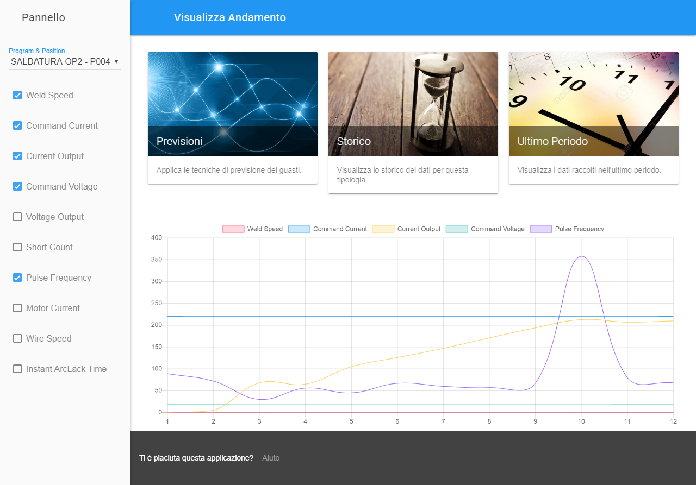

# DeviceLytics
Have you ever wondered how much any data is actually valuable? This project aims to provide a useful tool for data analysis, with a simple and intuitive user interface.

## Why was this project born?
This project was born from a real need. Then I realized that would be a nice idea to pick it up as a thesis for my Bachelor Degree.

## About the project
This project lives in an Industry 4.0 context. Through analysis of data, coming from multiple sources, such as industrial machinery, this software can bring a real help and support for industry production. For instance, component failure prediction during manufacturing is one of the main goal of this project. As a result, it represents an added value to companies' business.

## Technical notes
This project is developed using web-based technologies. The software is usable through ordinary web browsers, even mobile devices. The back-end is written in Java, using servlets. Jetty (version 9.3.12.v20160915 is used during development) was adopted as servlet container, to keep this software as lightweight as possible.
